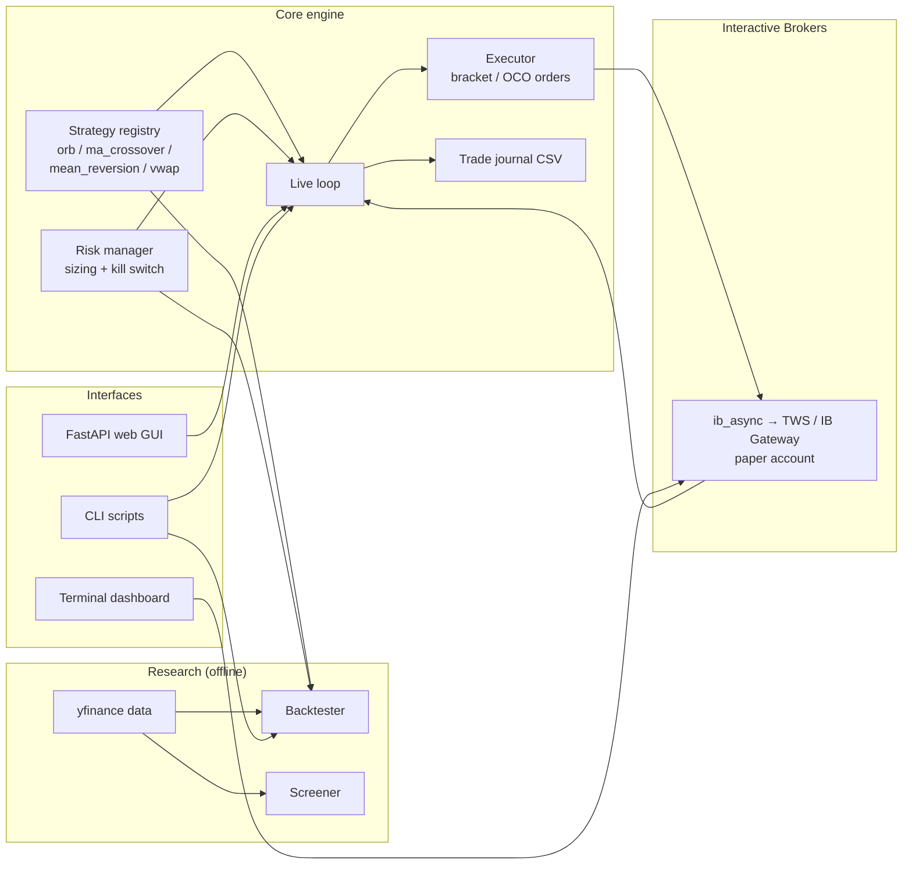

# IBKR Day Trader

An end-to-end algorithmic trading platform for Interactive Brokers: an event-driven backtester, a pluggable strategy engine, a risk-managed live paper-trading loop, and a FastAPI web dashboard — built in Python with a safety-first design.

> **⚠️ Paper trading only.** This project is an educational/portfolio piece and runs against an IBKR **paper (simulated) account**. It is not financial advice, not a profitable system, and has never been used to trade real money. Live trading is disabled by default and guarded at multiple levels (see [Safety design](#safety-design)). Day trading is high-risk and most retail day traders lose money.

## What it does

- **Backtests** intraday strategies over historical OHLCV bars with realistic mechanics: next-bar execution (no look-ahead bias), intrabar stop-loss/take-profit modeling, commission and slippage, and end-of-day flattening.
- **Screens** a configurable watchlist each morning for fresh entry signals.
- **Paper-trades automatically** through IBKR's TWS/Gateway API: evaluates strategies on live bars, sizes positions under risk limits, places bracket orders (entry + stop-loss + take-profit as one OCO group), and flattens everything before the close — no overnight exposure.
- **Enforces risk** with a standalone risk manager: position-size caps, per-trade stops, daily trade limits, and a daily-loss **kill switch** driven by the broker's authoritative P&L.
- **Monitors** everything through a browser dashboard (positions, P&L, journal feed, loop controls, inline risk editing) or a terminal dashboard, and journals every signal, order, and fill to CSV.

## Architecture



| Layer | Modules | Responsibility |
|---|---|---|
| Strategies | `src/strategies/` | Abstract `Strategy` base class + decorator-based registry. Each strategy maps OHLCV bars to a long/flat `target` series. Four built-ins: opening-range breakout, MA crossover, RSI mean reversion, VWAP. |
| Backtesting | `src/backtester.py` | Pure-pandas event-driven engine — no network, fully deterministic, runs in CI. Conservative fills (stop assumed first when stop and target hit in the same bar). |
| Risk | `src/risk.py` | Position sizing and a broker-independent `RiskManager` gatekeeper (kill switch, max trades/day, max open positions). Pure logic, fully unit-testable offline. |
| Broker | `src/broker.py`, `src/async_broker.py` | IBKR connection via `ib_async`, with paper/live account verification, equity retrieval with retry, historical bars, P&L stream, and flatten helpers. Sync and async variants share the same behavior. |
| Execution | `src/executor.py`, `src/async_executor.py` | Every entry goes in as a bracket: parent order + stop-loss + take-profit in one OCO group, so no position is ever unprotected. |
| Live loop | `src/live.py`, `src/async_live.py` | Polls closed bars per symbol, acts at most once per bar, syncs state from the broker portfolio, and force-flattens before the market close. The async variant runs as a background task inside the web server. |
| Web GUI | `src/web/` | FastAPI app + vanilla-JS single-page app: live account view, loop controls, backtest runner, screener, and risk-parameter editing that persists back to YAML (comments preserved via `ruamel.yaml`). Binds to `127.0.0.1` only. |
| Config | `src/config.py`, `config.yaml` | Single validated YAML file for every knob; per-symbol strategy assignment for the live loop. |

### Engineering decisions worth noting

- **Look-ahead bias avoidance.** Signals act on the *next* bar's open, and the live loop only evaluates *closed* bars — the backtest and live behavior match.
- **Safety as architecture, not convention.** Live trading requires two independent config flags, and the broker layer verifies the *actual* connected account type (paper accounts start with `DU`) before any order can be sent — a wrong-port mistake aborts the connection.
- **Testability by separation.** The backtester and risk manager have zero broker dependencies, so the core logic is exercised offline; the web layer is tested against a mocked broker.
- **Sync/async duals.** The CLI uses blocking `ib_async` calls; the web server needed the same loop as a non-blocking `asyncio` task. Rather than force one model onto both, the live trader and broker exist in mirrored sync/async versions.

## How to run

**Prerequisites:** Python 3.11+, and an IBKR account with [TWS or IB Gateway](https://www.interactivebrokers.com/en/trading/ibgateway-stable.php) installed (only needed for live-data features — backtesting and screening work without it).

```bash
# 1. Install
python -m venv .venv
source .venv/bin/activate          # Windows: .venv\Scripts\activate
pip install -r requirements.txt

# 2. Configure
cp config.example.yaml config.yaml # edit port/watchlist as needed

# 3. Verify the core (no broker required)
python tests/test_core.py
python tests/test_web.py

# 4. Backtest a strategy (no broker required)
python run_backtest.py --symbol AAPL --strategy orb

# 5. Screen the watchlist for fresh signals
python run_screener.py
```

For the broker-connected pieces, run TWS or IB Gateway, log in to a **paper** account, enable *ActiveX and Socket Clients* under API settings, and set `broker.port` in `config.yaml` (paper: TWS `7497`, Gateway `4002`). Then:

```bash
python run_gui.py            # web dashboard at http://127.0.0.1:8000
python run_dashboard.py      # terminal dashboard
python run_trade.py --symbol AAPL   # one confirmed trade (asks before sending)
python run_live.py           # autonomous paper-trading loop
```

## Safety design

- **Paper/live guard.** `broker.mode: live` is refused unless `allow_live: true` is also set, and the connected account number is checked against the configured mode before proceeding.
- **Kill switch.** If the day's P&L (realized + unrealized, from IBKR's own stream) breaches `risk.daily_max_loss_pct`, all new entries halt for the day and open positions can be auto-flattened.
- **Bracketed everything.** Stop-loss and take-profit are submitted atomically with every entry.
- **No overnight risk.** The loop flattens all positions a configurable number of minutes before the close.
- **Human confirmation** for single trades (`run_trade.py` requires typing `yes`), and graceful flatten-on-exit for the autonomous loop.

## Tech stack

Python · pandas / NumPy · [ib_async](https://github.com/ib-api-reloaded/ib_async) (IBKR API) · yfinance (research data) · FastAPI + Uvicorn (web GUI) · Rich (terminal dashboard) · PyYAML / ruamel.yaml (config)

## Disclaimer

This software is provided for educational purposes only. It is designed for and tested exclusively against **paper (simulated) trading accounts**. Nothing in this repository constitutes financial, investment, or trading advice, and no representation is made about the profitability of any included strategy — backtested results do not predict future performance. If you adapt this code, you assume full responsibility for every order it places. Consult IBKR's terms and a licensed financial professional before considering any form of live trading.
